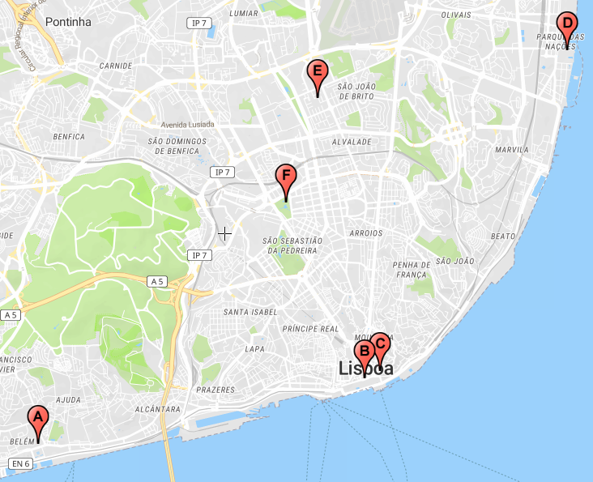

# SureThing-LX-dataset

## Introduction

The LXspots dataset has been collected as part of the first evaluation of the CROSS-Scavenging mobile app that was developed for the Smart tourism use case of the [SureThing project](http://surething-project.eu).
Please refer to the technical report for more details.

## Data collection

The dataset was collected over a six month period across six different tourism locations distributed among the city of Lisbon, Portugal.

### Locations

The locations are:

* Jerónimos;
* Comércio;
* Sé;
* Oceanário;
* Alvalade;
* Gulbenkian.

<p align="center">
    
</p>

The collected data is composed by discrete measurements of the existing Wi-Fi networks at the locations.
The measurements contain detailed information obtained through Wi-Fi scanning, such as MAC addresses and signal intensities.
For redundancy, the data collection was done using three different smartphones running the Android operating system: Samsung Galaxy S9, Huawei Mate 10 and LG V10 thinq.

### Description of the data

The approach we followed in the data collection was to visit each location, during the course of a day, and gather data for a time span of 15 minutes.
The visit route was settled from location A to F for ease of navigation through the city.
The first collection route was on *July 19 2019*, and the last one was on *January 19 2020*.
The following table details each of the days and the rationale for selecting them.

| ID    |Day                     |Observations                       |
|-------|------------------------|-----------------------------------|
|  1    | 2019-07-19             | First day of scavenging           |
|  2    | 2019-07-26             | One week after first scavenging   |
|  3..9 | 2019-07-29: 2019-08-04 | Full week of scavenging           |
|  10   | 2019-08-19             | One month after first scevenging  |
|  11   | 2020-01-19             | Six months after first scevenging |

### Folder structure

The following is the structure of the folders in the dataset, grouped by location under each collection day.

```sh

LXspots/
  -2019-06-21
    -Jerónimos
    -Comércio
    -Sé
    -Oceanário
    -Alvalade
    -Gulbenkian
  -2019-07-19
  -2019-07-26
  -2019-07-29
  -2019-07-30
  -2019-07-31
  -2019-08-01
  -2019-08-02
  -2019-08-03
  -2019-08-04
  -2019-08-19

```

### File format

The files are in `.txt` format.  
The files are called `Alice` for device A, `Bob` for device B, and `Charlie`for device C.  
The `bt` suffix refers to some experimental Bluetooth data collection.

### Features

The full details of the features included in the dataset are presented in the following table.

|Feature  | Description   |
|---------------|---------------|
|device_id|Device identifier [A, B, C]   |
|date       |Date of the observation   |
|time       |Time of the Observation   |
| ref_name  | Location reference name    |
|latitude |Latitude in degrees|
|longitude | Longitude in degrees.|
|altitude |Altitude in meters above the WGS 84 reference ellipsoid.|
|accuracy |Estimated horizontal accuracy, radial, in meters.|
|ssid | The network name.|
|bssid |The address of the access point.|
|capabilities | Authentication, key management, and encryption schemes supported.|
|frequency |The primary frequency of the channel [MHz].|
|level |The detected signal level in dBm, also known as the RSSI.|
|centerfreq0|0 if AP bandwidth is 20 MHz. If the AP uses 40, 80 or 160 MHz, center frequency [MHz]. AP use 80 + 80 MHz, center frequency of the first segment [MHz].|
|centerfreq1 | AP use 80 + 80 MHz, center frequency of the second segment [MHz].|
|channelwidth | Channel bandwidth [0=20MHz; 1=40MHz; 2=80MHz; 4=160MHz].|

## Authors

* Rui Claro
* Samih Eisa
* [Miguel L. Pardal](http://web.tecnico.ulisboa.pt/miguel.pardal)

## License

This project is licensed under the MIT License.

## Acknowledgments

Thanks to all the team of the SureThing project.
